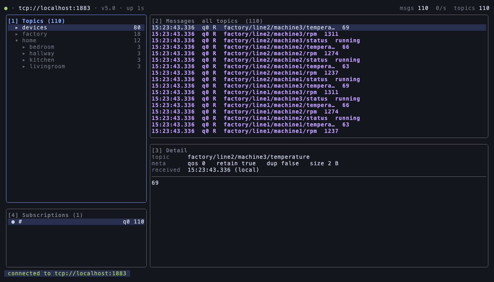

# lazymqtt

A keyboard-driven TUI MQTT client, in the spirit of lazygit and lazydocker.
Single static binary, Linux and macOS.



> **Status: v0.x, pre-release.** The config schema is not yet stable — don't
> build tooling on it. See [STATUS.md](STATUS.md) for what is implemented,
> what is verified, and what is still missing.

## What it does

- **JSON payloads are pretty-printed and syntax-highlighted** in the detail
  pane, automatically and off the UI goroutine, so a nested payload is
  readable without leaving the app. `F` turns it off.
- **Live topic tree** with per-node message counts, so the chatty topic is
  obvious at a glance. LRU-capped, so a broker publishing to
  `sensors/{uuid}/data` cannot exhaust memory.
- **Message history per topic**, not just the latest payload — you need the
  last N values to judge whether something is working.
- **Bounded memory by construction.** Four caps enforced at ingest, with a
  visible drop counter: a view that is lossy says so.
- **Survives a firehose.** Messages are coalesced into at most 20 batches per
  second before reaching the UI, whether the broker sends 10 messages or
  100,000.
- **Correct reconnection.** Subscriptions are re-issued on every connection,
  not once at startup — so messages actually resume after a network blip.
- Publish, subscribe and unsubscribe at runtime; requested vs. granted QoS
  shown, because a silent downgrade is common.
- Pause, follow and autoscroll; incremental filter over topics and payloads;
  copy to clipboard over OSC52, so it works over SSH with no helper binary.
- No telemetry, no phone-home, no auto-update.

## Install

Homebrew, on macOS or Linux:

```sh
brew install Onizuka893/tap/lazymqtt
```

From source, with any Go 1.25 or newer:

```sh
go install github.com/Onizuka893/lazymqtt/cmd/lazymqtt@latest
```

Or download an archive from
[Releases](https://github.com/Onizuka893/lazymqtt/releases) — `linux` and
`macOS`, `x86_64` and `arm64`, plus a best-effort Windows build. Every release
ships a `checksums.txt`; verify before installing:

```sh
sha256sum -c checksums.txt --ignore-missing
tar -xzf lazymqtt_0.1.0_macOS_arm64.tar.gz
install -m 0755 lazymqtt /usr/local/bin/lazymqtt
```

The binaries are unsigned, so on macOS Gatekeeper quarantines a downloaded
archive. The Homebrew cask clears that for you; a manual install needs
`xattr -d com.apple.quarantine /usr/local/bin/lazymqtt`.

## Quick start

No config file is needed:

```sh
lazymqtt -b tcp://localhost:1883
```

Press `?` for the full key reference.

To try it against a local broker with a realistic seeded topic tree:

```sh
make dev      # docker compose up + seed + run
```

## Configuration

```sh
lazymqtt config init     # writes a commented config, mode 0600
lazymqtt config check    # validates it and prints the resolved brokers
```

The file lives at `$XDG_CONFIG_HOME/lazymqtt/config.yaml`, or
`~/.config/lazymqtt/config.yaml`. Every key, default and validation rule is in
the [configuration reference](docs/configuration.md); what follows is the part
you actually need.

A minimal profile:

```yaml
version: 1
brokers:
  production:
    host: mqtt.example.com
    port: 8883
    tls:
      enabled: true
    username: ops
    # Preferred: read the secret at connect time from your password manager.
    password_cmd: "pass show mqtt/production"
    subscriptions:
      - filter: "devices/+/state"
        qos: 1
```

### Credentials

Resolved per broker, first match wins:

1. **`password_cmd`** — stdout of a command. Works with `pass`, `gopass`,
   `op read`, `bw get`, `security find-generic-password`, `gcloud secrets`.
   This is the recommended path.
2. **`password_env: MY_VAR`**
3. **`password:`** — a literal. Permitted, but lazymqtt **refuses to load a
   config containing one if the file is group- or world-readable**, the way
   OpenSSH refuses a private key.
4. **An interactive prompt**, if you set `username` with no password source.
   Collected before the TUI starts; it is never written anywhere.

### TLS

Set `tls.enabled: true`. The scheme is load-bearing — it is what actually
selects an encrypted connection — so `tls.enabled` rewrites `mqtt://`/`tcp://`
to `tls://` regardless of port. TLS on the conventionally plaintext port 1883
is unusual but supported.

For a private CA, add `ca_file:`. `insecure_skip_verify: true` works but
paints a permanent red banner for the whole session, rather than a warning
that scrolls away.

## Keys

| | |
|---|---|
| `?` | Help overlay |
| `Tab` / `1`–`4` | Switch panel |
| `j`/`k`, `h`/`l` | Move, collapse/expand |
| `g` / `G`, `ctrl+d` / `ctrl+u` | Top/bottom, half page |
| `s` / `u` | Subscribe / unsubscribe |
| `p` | Publish |
| `c` / `r` | Broker picker / force reconnect |
| `/`, `n` / `N` | Filter, next/previous match |
| `y` / `Y` | Copy payload / topic |
| `Space` | Pause the view (the connection stays up) |
| `f` / `a` | Follow / autoscroll |
| `t` / `w` / `F` | Retained-only / wrap / JSON pretty-print on/off |
| `x` / `X` | Clear topic / clear all |
| `ctrl+l` | Logs |
| `q` / `ctrl+c` | Quit |

The help overlay is generated from the same binding registry the dispatcher
matches on, so it cannot drift out of date.

The mouse is off by default: with mouse reporting on, the terminal stops
handling drag-select and middle-click paste itself. Set `ui.mouse: true` to
trade that for wheel scrolling and click-to-focus.

## Scriptable subcommands

`lazymqtt` is also a toolkit, reusing the same MQTT layer with no UI:

```sh
lazymqtt brokers                     # list configured profiles
lazymqtt pub <topic> <payload|->     # -q N, -r
lazymqtt sub '<filter>' --json       # NDJSON, pipe it into jq
lazymqtt --headless -b prod -t '#'   # stream to stdout, no TUI
```

Reach for `--headless` first when something is wrong: if messages stream
there, the connection is fine and the problem is in the UI.

## Files it writes

| Path | Contents |
|---|---|
| `$XDG_CONFIG_HOME/lazymqtt/config.yaml` | Your configuration. lazymqtt **only ever reads** this, so your comments and formatting are safe. |
| `$XDG_STATE_HOME/lazymqtt/state.json` | Last broker profile, which tree nodes were open, recent publish payloads. Written on exit, mode 0600, safe to delete. Never contains credentials. |

## Building

```sh
make build       # CGO_ENABLED=0, -trimpath, version ldflags
make test        # go test -race ./...
make test-short  # the same, minus the slow memory-ceiling tests
make lint        # golangci-lint + gofumpt
make test-int    # integration tests against a real broker
make bench       # ingest, render and keypress benchmarks
make demo        # re-record docs/demo.gif with vhs, against the dev broker
```

Requires Go 1.25+. See [CONTRIBUTING.md](CONTRIBUTING.md) for the layering
rules and the decisions worth knowing before changing anything, and
[docs/releasing.md](docs/releasing.md) for how a tag becomes a release.

## Security notes

Payloads are attacker-controllable bytes rendered into a terminal, so every
payload and topic passes through a sanitiser that strips `ESC`, C0/C1 controls
and Unicode format characters before display. The raw bytes are kept in the
store, so copy and export stay faithful.

Debug logging never records payload bytes — no log call at any level includes
a payload. (`logging.redact_payloads` is accepted by the config parser but is
currently vacuous for that reason; see
[docs/configuration.md](docs/configuration.md).)

## Licence

MIT. Both Eclipse Paho libraries are EPL-2.0/EDL-1.0, which is compatible.
